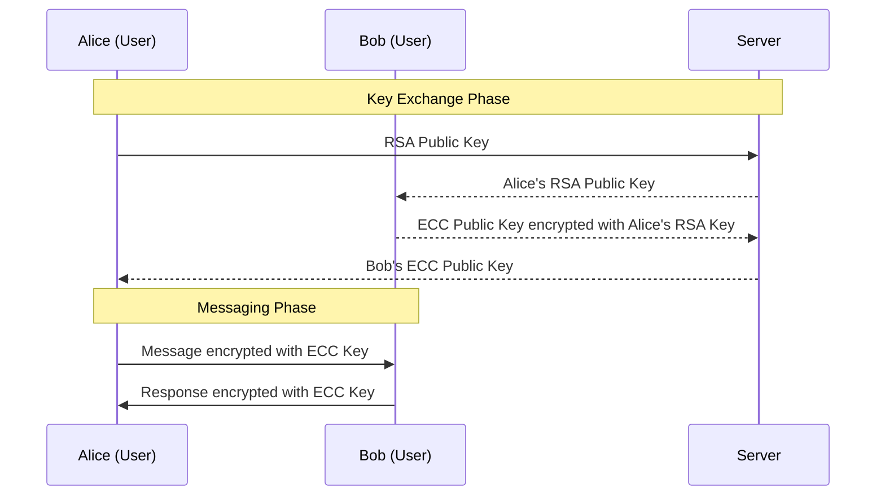

<div style="display: flex; justify-content: center; align-items: center; width: 500px; margin: 0 auto;">
    
    
    <div style="padding: 20px; text-align: center;">
        <h3 style="font-size: 16px;">CryptoChatApp</h3>
        <h3 style="font-size: 16px;">Guillaume Dorschner & Quentin Le Nestour</h3>
    </div>
    
</div>

# Introduction

CryptoChatApp is a messaging application demonstrating cryptographic principles implemented from scratch. Without relying on external cryptographic libraries, it explores the fundamentals of **RSA** (asymmetric encryption) and **Elliptic-Curve Cryptography (ECC)** (symmetric encryption). Built using **React.js** and **Node.js**, the app supports real-time messaging through WebSocket. For more detailed information, check out the [Diagrams & Explanations](#diagrams--explanations) section.

# Demo


# Getting Started

> **Note**: This project is for educational purposes and is not intended for production use.

## Installation

1. Download the zip file [here](gitjisjfd.com) or clone the repository:

   ```bash
   git clone https://github.com/GuillaumeDorschner/CryptoChatApp.git
   cd CryptoChatApp
   ```

2. Start the app with Docker:

   ```bash
   docker compose up
   ```

3. Open the app in your browser at `http://localhost:3000`.

# Diagrams & Explanations

## Key Features

1. **RSA**: Used for secure key exchange between users.
2. **ECC**: Handles message encryption and decryption.
3. **WebSocket**: Enables real-time communication without a login system.

## Message Encryption Flow



## Technology Stack

All the code is written in **JavaScript**, with the following components:

- **Frontend**: React.js
- **Backend**: Node.js
- **Real-time Messaging**: WebSocket (with `ws`)
- **Custom Cryptography**: RSA and ECC implemented manually.

# License

This project is licensed under the MIT License.
