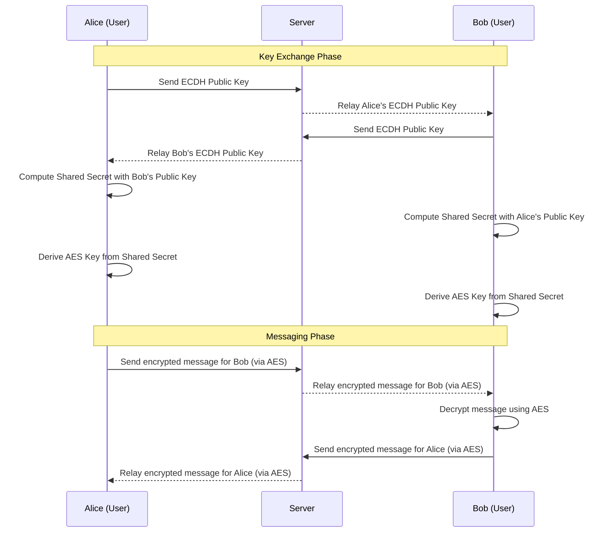

<div style="display: flex; justify-content: center; align-items: center; width: 500px; margin: 0 auto;">
    
    
    <div style="padding: 20px; text-align: center;">
        <h3 style="font-size: 16px;">CryptoChatApp</h3>
        <h3 style="font-size: 16px;">Guillaume Dorschner & Quentin Le Nestour</h3>
    </div>
    
</div>

# Introduction

CryptoChatApp is a messaging application demonstrating cryptographic principles implemented from scratch. Without relying on external cryptographic libraries, it explores the fundamentals of **Elliptic-curve Diffie–Hellman** (asymmetric encryption) for key exchange and **AES** (symmetric encryption) for message security. Built using **React.js** and **Node.js**, the app supports real-time messaging through WebSocket. Refer to the [Message Encryption Flow](#message-encryption-flow) section for detailed cryptographic workflows.

## Demo


## Getting Started

> **Note**: This project is for educational purposes and should not be used in production.

### Prerequisites

- Ensure [Docker](https://www.docker.com/) is installed on your system.

### Installation

#### Using Docker

```bash
docker pull ghcr.io/guillaumedorschner/rtu-cryptochatapp:latest
docker run -p 80:80 -p 3000:3000 -p 3001:3001 ghcr.io/guillaumedorschner/rtu-cryptochatapp:latest
```

Then open your browser and visit `http://localhost`.

#### Clone the repository

1. Clone the repository:

   ```bash
   git clone https://github.com/GuillaumeDorschner/CryptoChatApp.git
   cd CryptoChatApp
   ```

2. Start the application with Docker:

   ```bash
   docker compose up
   ```

3. Open your browser and visit `http://localhost:3000`.

## Key Features

1. **ECDH**: Used to securely exchange the symmetric AES key between users.
2. **AES**: AES ensures message confidentiality by using a symmetric key derived from the ECDH shared secret.
3. **WebSocket**: Facilitates real-time encrypted messaging by relaying data between users, without requiring server-side storage of messages.

## Message Encryption Flow

The server acts solely as a relay and does not decrypt or store messages.



For a detailed explanation of this project, refer to the [Technical Design System](./Technical%20Design%20System.md).

## Cryptographic Concepts

### Why Use ECDH?

Elliptic-Curve Diffie-Hellman (ECDH) is chosen for its high security with smaller key sizes compared to RSA or traditional Diffie-Hellman, making it faster and more efficient.  
📹 [Watch: Elliptic Curve Cryptography Explained](https://youtu.be/NF1pwjL9-DE)

### What is AES?

AES (Advanced Encryption Standard) is a symmetric encryption algorithm widely used for its speed and security.  
📹 [Watch: AES Explained](https://youtu.be/O4xNJsjtN6E)

### Common Issues with ECC

ECC, while secure, has implementation challenges and requires careful attention to avoid side-channel attacks.  
📹 [Watch: Problems with ECC](https://youtu.be/nybVFJVXbww)

### Learn Cryptographic Basics

For an introduction to public and private key cryptography, check out this beginner-friendly explanation:  
📹 [Watch: Diffie-Hellman and ECC with Color Analogy](https://youtu.be/NmM9HA2MQGI)

## Technology Stack

- **Frontend**: React.js
- **Backend**: Node.js
- **Real-time Messaging**: WebSocket (via `ws`)
- **Custom Cryptography**: ECDH and AES implemented manually.

## License

This project is licensed under the MIT License.
