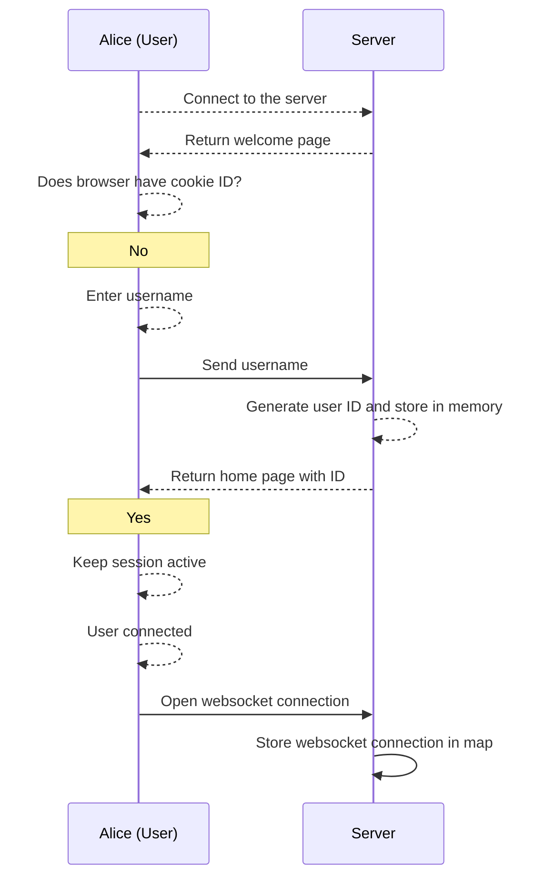
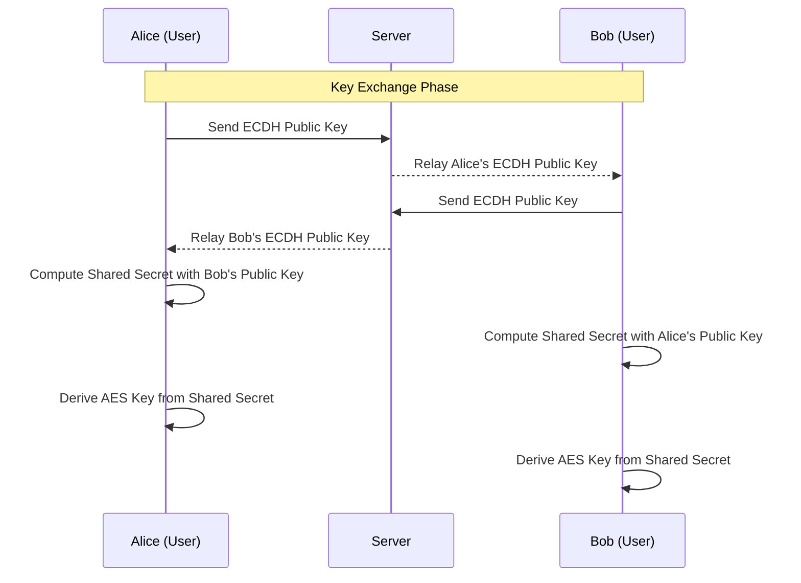
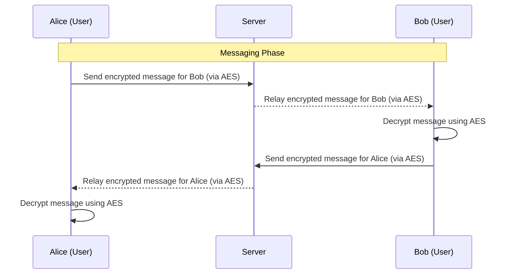
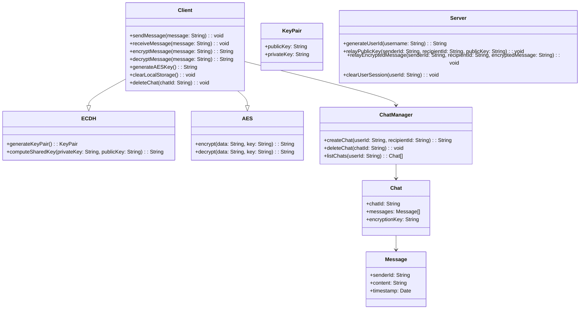

# **Technical Design System**

This technical design document provides a comprehensive overview of the project without requiring developers to dive into the code. It describes the software architecture, key workflows, and data handling in detail.

## **Overview**

The project is a secure real-time chat application using **ECDH** for key exchange and **AES** for message encryption. It stores user sessions via cookies and local storage, enabling seamless user experiences. Discussions are encrypted and can be deleted along with their associated keys. Users can view encryption keys as QR codes like for added flexibility.

### **Key Features**:

1. **User Authentication**:

   - Each user is assigned a unique ID upon login, stored in cookies.
   - Sessions persist across browser reloads unless manually cleared.

2. **Chat Management**:

   - Users can initiate chats by entering another user's ID.
   - Chat requests must be accepted before exchanging messages.
   - A list of ongoing chats is displayed on the left panel.

3. **Encryption**:

   - Each chat session uses its own **ECDH** key pair for secure key exchange and an **AES** key for message encryption.
   - chats info show associated keys. Encryption keys are displayed as colored QR codes for easy coparison.

## **Workflow**

### **1. User Initialization**

Users are assigned an ID upon their first connection, and sessions persist using browser cookies.

### **2. Key Exchange Workflow**

Securely exchange ECDH keys and establish an AES key for chat encryption. [Wikipedia](https://en.wikipedia.org/wiki/Elliptic-curve_Diffie–Hellman)

### **3. Messaging Workflow**

The server acts solely as a relay and does not decrypt (can't it's end to end encrypted) or store messages. Messages are securely encrypted and exchanged between users using AES. AES ensures message confidentiality by using a symmetric key derived from the ECDH shared secret

## **Architecture**

### **Class Diagram: System Architecture**

This diagram outlines the key components of the system and their interactions.

## **Storage Strategy**

- **Cookies**: Store the user's unique ID to persist sessions.
  - if clear the id / user / discution will be lost.
- **Local Storage**: Store chat discussions and their associated encryption key.
  - id discussions are deleted the chat and the key will be lost.
